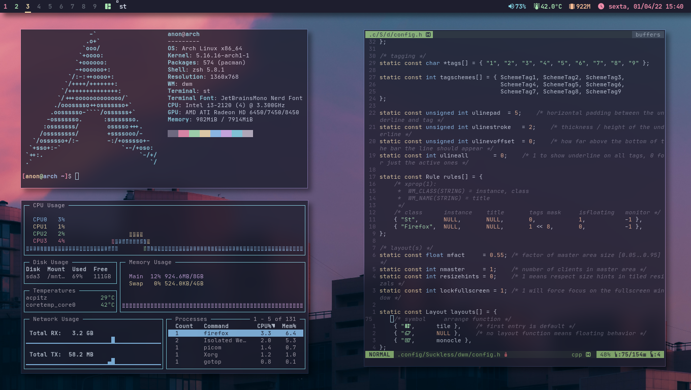

# Dotfiles
My current Arch Linux installation, using Wayland and Hyprland:

Old Arch Linux setup, with X11 and DWM.

This repo contains personal dotfiles of my Arch Linux setup for backup purposes and my own future reference.

For short, Dotfiles are text-based configuration files of Unix based systems. They can be used to customize your Linux installation.

## Why do this repository exists?

- I can use it as a backup, if needed;
- I can use it as a way of learning git;
- I can use it to easily share my dotfiles with other people;

## Softwares that I use in my Linux installation

- Display server: [Wayland](https://wayland.freedesktop.org/)

A new display server that aims to replace X11, with a more modern aproach on its core philosophy.

- Window manager: [Hyprland](https://hyprland.org/)

A cool Dynamic Tiling Window manager for Wayland, that manages to be at the same time good looking and lightweight.

- Terminal emulator: [Alacritty](https://alacritty.org/)

A performant and modern terminal emulator written in Rust.

- Terminal shell: [Zshell](https://www.zsh.org/)

A very good middle ground between more raw shells like bash and friendly shells like fish. Also highly customizable due the great variety of plugins.

- Music player (backend): [Music Player Daemon](https://musicpd.org/)

A simple and flexible backend for playing music on Linux.

- Music player (frontend): [NCurses Music Player Client Plus Plus](https://github.com/ncmpcpp/ncmpcpp)

A terminal frontend for playing music with MPD. It is lightweight and it has various features.

- Video player: [mpv](https://mpv.io/)

A free and open source video player.

- Document viewer: [zathura](https://pwmt.org/projects/zathura/)

A minimalistic and customizable document viewer. It can support different file formats through plugins.

- Text editor: [Neovim](https://neovim.io/)

A fork of Vim, a powerfull and extensible text editor, made even better by the lua integration and improved codebase.

- Colorscheme: [Catppuccin](https://github.com/catppuccin/catppuccin)

A pleasant for the eyes and warm colorscheme, great for long programming sessions.

- Font: [JetBrainsMono Nerd Font](https://github.com/ryanoasis/nerd-fonts/blob/master/patched-fonts/JetBrainsMono/Ligatures/Regular/complete/JetBrains%20Mono%20Regular%20Nerd%20Font%20Complete%20Mono.ttf)

A great font that is not only easy to read, but also supports icons and ligatures.

## Contact

Feel free to leave suggestions or report problems through the [Issue section](https://github.com/David-MoreiraJ/David-Dotfiles/issues), and many thanks for taking your time to read this far!
